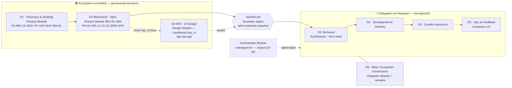
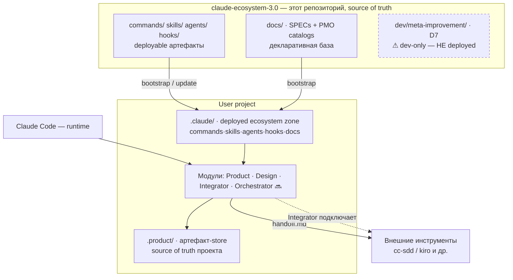

# Ecosystem 3.0 — карта системы (entry-point map)

> **Роль:** визуальная точка входа для свежей сессии / нового читателя. Это **индекс**, а не источник истины — каждая диаграмма ссылается на канонический документ, который описывает зону детально.
>
> **Канонические авторитеты** (диаграммы их визуализируют, не заменяют):
> - Pipeline D1-D6, кто owns / что delegated → [docs/pmo/pmo-map.md](pmo/pmo-map.md)
> - Артефакты (24 типа) и их зависимости → [docs/pmo/artifacts/README.md](pmo/artifacts/README.md)
> - Процессы P1-P5 → [docs/pmo/processes.md](pmo/processes.md) · Правила валидации → [docs/pmo/validation.md](pmo/validation.md)
> - Модули → [docs/product-module/SPEC.md](product-module/SPEC.md), [docs/design-module/SPEC.md](design-module/SPEC.md), [docs/integrator-module/SPEC.md](integrator-module/SPEC.md)
> - Статус «где мы сейчас» → [ROADMAP.md](../ROADMAP.md#где-мы-сейчас) (единственный источник)
>
> **Freshness-модель:** диаграммы coarse-grained (уровень модулей/доменов, не строк) — дрейфуют медленно. Обновлять только при изменении топологии модулей или набора доменов, не каждую фазу. Mermaid-блоки (текст, git-diffable, рендерятся в GitHub и в Obsidian-vault).

---

## 1. Pipeline D1-D6 — что контролируем, что делегируем

Главный тезис экосистемы: **детальный контроль D1 + D2-Behavioral, делегирование остального через `handoff.md`.** `handoff.md` — boundary object: самодостаточный snapshot, который передаёт всё о фиче в любой инструмент-реализатор.

Детально (роли, обязанности D*-NN, статусы): [pmo-map.md](pmo/pmo-map.md).

---

## 2. C4 Container — из чего собрана система при установке

Что физически где живёт: репозиторий (source of truth) → bootstrap/update → зона `.claude/` в проекте + store `.product/`. **D7 (meta-improvement) — dev-only, никогда не deployed** в пользовательские проекты (частая путаница с D6).

D6 vs D7 disambiguation: [dev/meta-improvement/CONVENTIONS.md §1.3](../dev/meta-improvement/CONVENTIONS.md).

---

## 3. Artifact dependency graph (ERD) — reference-глубина

Граф зависимостей 24 артефактов (PS → HYP → FM → SC/BR/LC/…) намеренно **не дублируется** здесь — он живёт в прозе/таблицах [docs/pmo/artifacts/README.md](pmo/artifacts/README.md) (dependency graph) и в [pmo-map.md](pmo/pmo-map.md) (per-домен). Визуальный ERD — кандидат на добавление сюда, если/когда понадобится (low priority; обновляется только при добавлении типа артефакта).

> _Сознательно НЕ включено:_ таблица artifact→skill→command cross-ref. Она fine-grained (ломается почти каждую фазу при переименовании skill/добавлении команды) — высокий sync-cost, а неверная карта хуже отсутствующей. При необходимости — генерировать из frontmatter, не вести руками.
