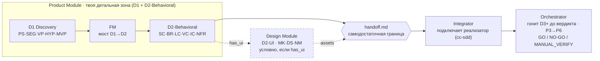

# docs/guide — руководство оператора · **НАЧНИ ЗДЕСЬ**

> **Слой 1 (USER) трёхслойной модели документации** — здесь про то, как **делать работу** через экосистему. Отличается от `docs/` (REFERENCE — «что это», спеки/каталоги) и `dev/` + `CLAUDE.md` (DEV — как устроена сама экосистема).
>
> **Это единый вход в USER-слой.** Новичок — начни отсюда: ниже лестница понимания (от «что это вообще» до «как устроена»), роутер «Я хочу…» и две интерактивные карты. Живой статус проекта — всегда в [ROADMAP «Где мы сейчас»](../../ROADMAP.md#где-мы-сейчас).

---

## За 60 секунд: что это

**Ecosystem 3.0 — PMO-слой (product management office) поверх Claude Code.** Ты ведёшь продукт **диалогом** с ассистентом; экосистема даёт структуру: какие артефакты создавать, в каком порядке, как их проверять и как передать в реализацию.

Главный принцип разделения труда: **ты детально контролируешь D1–D2 (стратегия + поведение фич), а всё остальное (архитектура, код, QA) делегируется наружу через один самодостаточный `handoff.md`.**

```
🟢 контролируешь ДЕТАЛЬНО          🔵 ДЕЛЕГИРУЕШЬ наружу
   D1  Discovery (стратегия)         D2-Tech · D3 разработка
   D2-Behavioral (спецификация)      D4 QA · D5/D6 ops
   D2-UI (если есть интерфейс)
            └──────── handoff.md ────────┘
```

**Анатомия одной картинкой** — четыре модуля на пайплайне D1–D6 и граница передачи:



_Диаграмма coarse — обновляется только при смене топологии модулей/доменов (как [docs/MAP.md](../MAP.md) «Freshness-модель»), не каждую фазу._ Глубже — [docs/MAP.md](../MAP.md) (pipeline + C4-контейнер); всё кликабельно — [ecosystem-map.html](ecosystem-map.html).

---

## Лестница понимания — L0 → L5

Осваивай по уровням масштаба: каждый следующий — глубже, но не нужен, пока не понадобился.

| Уровень | Вопрос | Куда смотреть |
|---|---|---|
| **L0** | Что это вообще такое | Блок «За 60 секунд» ↑ + [docs/MAP.md](../MAP.md) (одна схема) |
| **L1** | Как течёт пайплайн D1–D6 | [`00-concepts.md`](00-concepts.md) §2 (домены + кто владеет) |
| **L2** | Из чего собрано (модули · 24 артефакта · гейты) | [`00-concepts.md`](00-concepts.md) §3–6 + [ecosystem-map.html](ecosystem-map.html) |
| **L3** | Провести сессию руками — от идеи до handoff | [`01-first-session.md`](01-first-session.md) (+ [`04-ui-design.md`](04-ui-design.md), если есть UI) |
| **L4** | Превратить handoff в проверенный код | [`05-implementation.md`](05-implementation.md) |
| **L5** | Глубокий reference / как устроена сама экосистема | [docs/README.md](../README.md) → module SPEC · [CLAUDE.md](../../CLAUDE.md) (DEV-слой) |

---

## Я хочу… — задача к нужной двери

| Я хочу… | → |
|---|---|
| понять, что это и **как оно думает** | [`00-concepts.md`](00-concepts.md) |
| **провести первую фичу** от идеи до handoff | [`01-first-session.md`](01-first-session.md) |
| **спроектировать UI** фичи | [`04-ui-design.md`](04-ui-design.md) |
| превратить **handoff в код** | [`05-implementation.md`](05-implementation.md) |
| понять, **почему меня заблокировали** / что значит `NO-GO` | [`06-gates.md`](06-gates.md) |
| узнать, **где стоит линия фичи** между сессиями / что ждёт моего решения | [`07-fabric.md`](07-fabric.md) |
| найти **нужную команду** | [`02-commands.md`](02-commands.md) · [ecosystem-map.html](ecosystem-map.html) |
| **увидеть все процессы** целиком (BPMN) | [ecosystem-processes.html](ecosystem-processes.html) |
| вспомнить, **что за артефакт** `PS`/`FM`/`BR`… | [`03-glossary.md`](03-glossary.md) (словарь) |

---

## Две интерактивные карты

Открываются в браузере, без зависимостей (офлайн). Дополняют друг друга:

- 🗺️ **[ecosystem-map.html](ecosystem-map.html)** — *что существует*: пайплайн D1–D6, все ~43 команды («когда что»), 24 артефакта, глоссарий, фильтр «что работает сегодня».
- 🔀 **[ecosystem-processes.html](ecosystem-processes.html)** — *как течёт*: BPMN-граф всех процессов, drill-down **lane → процесс → шаг** в порядке таймлайна, side-panel с хуками/гейтами и правилами, слои связей, ad-hoc группировка «в моменте», просмотр `.md` прямо в карте.

Первая отвечает «какой командой сделать X?», вторая — «из каких шагов состоит процесс P и что его блокирует?».

---

## Что здесь — файлы и их роль

Роль — по [Diátaxis](https://diataxis.fr): **Tutorial** (учит на примере) · **How-to** (решает задачу) · **Reference** (справка) · **Explanation** (объясняет «почему»).

| Файл | Роль | Что это | Статус |
|---|---|---|---|
| **этот README** | Навигация | Единый вход в USER-слой: лестница, роутер, карты | ✅ |
| [`00-concepts.md`](00-concepts.md) | Explanation | Мысленная модель D1–D6 + цикл draft→approve + уровни ревью + граф артефактов + словарь — **прочитать первым** | ✅ v1 |
| [`01-first-session.md`](01-first-session.md) | Tutorial | Первая продуктовая сессия на сквозном примере: `init → plan → feature → handoff` с реальными approve-гейтами | ✅ v1 |
| [`04-ui-design.md`](04-ui-design.md) | How-to | Design Module (`has_ui`): когда включается, поток D.1→D.6, что производит | ✅ v1 |
| [`05-implementation.md`](05-implementation.md) | How-to | От handoff к коду: Integrator + Orchestrator (P3→P6), как читать вердикт `GO/NO-GO × readiness × conflicts` | ✅ v1 |
| [`06-gates.md`](06-gates.md) | Explanation · How-to | Почему тебя останавливают (approve / DA / refusal / вердикт) — гейты как страховка + что делать | ✅ v1 |
| [`07-fabric.md`](07-fabric.md) | How-to · Explanation | Process Fabric: линия фичи P3→P7 между сессиями — charter, `status`/owner-queue, PA-мост, как добавить процесс | ✅ v1 |
| [`02-commands.md`](02-commands.md) | Reference | Каталог всех команд «когда что» — **генерируется** из frontmatter (`gen:catalog`), не дрейфует | ✅ gen |
| [`03-glossary.md`](03-glossary.md) | Reference | Словарь: 24 артефакта (ID · название · ревью · родословная, по доменам) + сквозные термины — **генерируется** из спеков + overlay | ✅ gen |

---

## Провенанс

Статусы и описания в `ecosystem-map.html` / `ecosystem-processes.html` — из спеков; текстовый каталог команд [`02-commands.md`](02-commands.md) и словарь [`03-glossary.md`](03-glossary.md) **генерируются** (`npm run gen:catalog` / `gen:glossary`, `--check` валит при рассинхроне) — анти-дрейф, согласуется с решением [docs/MAP.md](../MAP.md) не вести cross-ref-таблицы руками. Обе интерактивные карты тоже генерируются из SSOT (`gen-ecosystem-map` / `gen-process-map`, в `npm run verify`) — правь overlay/шаблон, не сгенерированный HTML. Канонический статус «где мы сейчас» — всегда [ROADMAP.md](../../ROADMAP.md#где-мы-сейчас).
