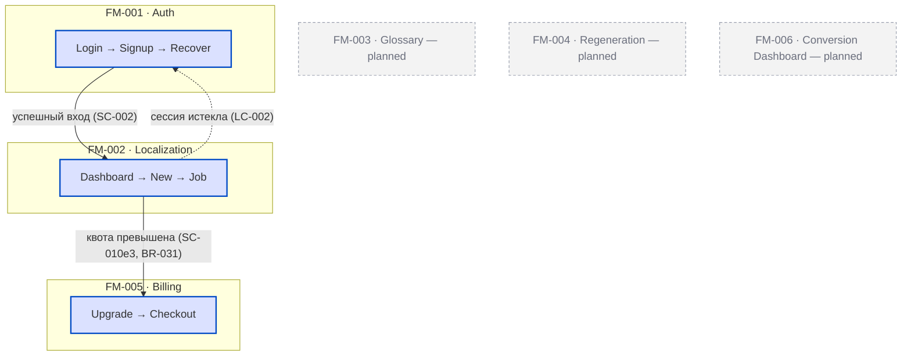
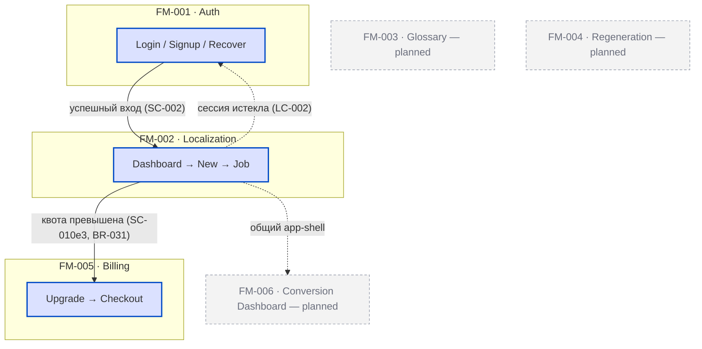

# AM — App Map (карта приложения + CJM-слой)

> **Тип:** app-map
> **Домен:** D2-B04 — Design Module
> **Review:** 🟢 Confirmation
> **Cardinality:** Singleton per product
> **Файл:** `.product/app-map.md` (корневой singleton) + генерируемый `.product/app-map.html` (визуальный USER FLOW) + canonical экраны `.product/mockups/assets/<fm>/SI-N.{html,png}` (committed canonical screens)
> **Владелец:** Design Module — derived из FM-* + NM-* + SC-* (+ LC/BR guards), editorial-слой подтверждает человек

## Purpose

**Карта всего приложения «сверху» (tier-3).** Один взгляд на продукт: какие есть **модули** (FM-*), как они связаны **путями** между собой (cross-module handoffs), какие **кейсы** (SC-*) проходят сквозь модули, и — поверх — **CJM-слой**: стадии клиентского пути, эмоции и боли.

Надстройка над per-flow NM-*: AM **ссылается** на NM (drill-down внутрь модуля), но **никогда не переписывает** переходы между экранами — они живут в NM. AM хранит только то, что **не выводится** автоматически: группировку модулей, межмодульные рёбра, primary journeys и редакторский CJM-слой. Механический слой (список модулей, наличие NM, drill-down-ссылки) **генерируется**.

Три «зума»: **L0 = AM** (приложение целиком) → **L1 = NM-*** (флоу одного модуля) → **L2 = MK-* / Open Design** (пиксельный экран).

**Три слоя AM:**
- **Module map (L0)** — модули + межмодульные рёбра (markdown §1, Mermaid).
- **USER FLOW** — движение по **экранам** (SI-N из NM) со стрелками и пометками. Рендерится в **`.product/app-map.html`** — self-contained визуальный артефакт: обзор-граф экранов (PNG-тхумбнейлы + SVG-стрелки + триггеры из NM §3) → клик по экрану → проигрыватель «экран за экраном». Источник — NM (таблицы переходов) + canonical PNG из committed **`.product/mockups/assets/<fm>/SI-N.png`** (рендер headless Chrome из canonical `SI-N.html`; OD-independent, воспроизводимо офлайн). HTML **генерируется**, не редактируется руками; NM не дублируется. Команда: `/design:map --html`.
- **CJM** — эмоциональные стадии пути (markdown §5).

## Frontmatter Schema

```yaml
---
id: AM                                   # singleton, без номера
type: app-map
title: "App Map: <product name>"
status: draft | active | deprecated
modules: [FM-001, FM-002, ...]           # ВСЕ FM, включая те, у кого ещё нет NM
navigation_maps: [NM-001, NM-002, ...]   # подмножество modules, у которых есть L1 drill-down
cross_module_edges:                      # editorial: хендоффы, которых нет ни в одном NM целиком
  - from: FM-001
    to: FM-002
    trigger: "успешный вход"
    guard: SC-002                        # ссылка на SC/LC/BR, НЕ inline-условие
cjm_stages:                              # editorial spine, упорядочен
  - id: discover
    label: "Discover"
    modules: [FM-006]                    # какие модули закрывают стадию
    emotion: neutral                     # neutral | positive | delighted | anxious | frustrated
    pain: ""                             # где болит (строка; ссылки на SC/HYP/NOTE приветствуются)
primary_journeys: [SC-010, SC-002]       # editorial: критичные/happy пути сквозь модули
confidence: high | medium | low          # C2 — обязательно
confidence_notes: "string"               # required если confidence != high
created: YYYY-MM-DD
updated: YYYY-MM-DD
version: 1
---
```

## Body Structure

Обязательные секции (5):

1. **App Map Diagram.** Mermaid `flowchart`: один `subgraph` на каждый модуль (FM). Внутри живого модуля — entry-узел + primary-путь (1–2 узла) с `click`-ссылкой на его NM. Модули без NM — один пунктирный `classDef planned` узел («запланировано, NM нет»). Между модулями — cross-module рёбра с triggers + guards. CJM-стадии — верхний пояс (swimlane) или `classDef`-полосы. Узлы кликабельны → drill-down в NM (L1) / MK / Open Design URL (L2).
2. **Module Inventory.** Таблица — *разбивка по модулям*: FM-id · title · has_ui · NM (или «—») · journey-role (primary/secondary/edge) · CJM-стадия(и).
3. **Primary Journeys (Cases).** Таблица — *разбивка по кейсам*: каждый primary SC → упорядоченная последовательность модулей/NM-узлов, которые он проходит + почему он критичен. Ссылки на существующие active SC.
4. **Cross-Module Handoffs (Paths).** Таблица — *разбивка по путям*: from-FM → to-FM, trigger, guard (ссылка на BR/LC/SC). Только те рёбра, которыми не владеет ни один отдельный NM.
5. **CJM & Pain Points.** Редакторский слой: упорядоченные стадии + эмоция + боль на стадию + ссылки на SC/HYP/NOTE. Самая ценная не-выводимая часть; именно её подтверждает человек.

## Content Rules

- **Все модули присутствуют.** Каждый FM из `modules[]` резолвится в существующий FM; каждый FM с `has_ui:true` и active NM присутствует в диаграмме и имеет drill-down. (Аналог NM-правила «все MK-экраны в диаграмме».)
- **Никакого дублирования NM.** AM ссылается на NM/SC по ID и **не переписывает** внутримодульные переходы. Переходы между экранами — зона NM, не AM. Это anti-duplication firewall: ломается дублирование — теряется единственный смысл AM.
- **Каждое cross-module ребро имеет trigger + guard.** Ссылка на BR/LC/SC, не inline «как-то попадает». (Та же дисциплина, что у NM на transitions.)
- **NM-less модули — пунктирные `planned`-узлы.** Graceful degradation: отсутствие NM = ветка генератора, не ошибка. Без drill-down-ссылки.
- **CJM-слой — editorial.** Стадии/эмоции/боли пишет и подтверждает человек; они не выводятся из артефактов. Ассистент может предложить черновик из PS/HYP/SC.
- **Primary journeys ссылаются на active SC.** Висячая ссылка на draft/удалённый SC → флаг на review.

### Mechanical vs Editorial (ключевое разделение)

| Слой | Кто заполняет | Что |
|------|---------------|-----|
| **Mechanical** (генерируется) | `/design:map` | `modules[]` (glob FM), `navigation_maps[]` (наличие NM), subgraph'ы, drill-down-ссылки на NM/MK/Open Design, внутримодульный primary-путь (ссылкой на NM) |
| **Editorial** (персистится, человек) | человек (черновик — ассистент) | `cross_module_edges[]`, `primary_journeys[]`, группировка/`journey-role`, `cjm_stages[]` + emotion/pain |

При перегенерации механический слой пересобирается и **диффится** против сохранённого AM; editorial-слой сохраняется. На дельту — статус `requires_review`, не молчаливая перезапись.

### Mermaid format



## Relationships

**Входящие:**
- ← FM-* (модули; `modules[]`)
- ← NM-* (per-flow drill-down L1 + внешние узлы = источник cross-module рёбер)
- ← SC-* (кейсы / primary journeys)
- ← LC-* / BR-* (guards на cross-module рёбрах)
- ← HYP / PS (обоснование CJM-болей и эмоций)

**Исходящие:**
- → Handoff (обзорный site-map, опционально в §10/§11)
- → Open Design (интерактивный рендер L0 — **v2**, по реальной боли: >8 модулей / «спагетти»)

**Cascade impact:**
- Новый/удалённый FM → набор модулей AM изменился → AM `requires_review` (если добавлен NM-less — пометить как planned-stub).
- Новый NM, либо у NM появилось/исчезло внешнее ребро (cross-module хендофф) → cross-module рёбра AM могут устареть → `requires_review`.
- MK добавлен/удалён → сначала затрагивает NM (существующий каскад); до AM доходит только если меняется внешняя точка входа/выхода NM.
- SC, помеченный primary, сменил статус/удалён → ссылка в `primary_journeys[]` может повиснуть → `requires_review`.
- LC/BR, на который ссылается cross-module guard, изменился → guard ребра ре-валидируется.

## Review Level: 🟢 Confirmation

Derived + editorial. Ассистент собирает механический слой и предлагает черновик editorial-слоя; человек подтверждает группировку, межмодульные рёбра, primary journeys и CJM (стадии/эмоции/боли). Авто-approve возможен при `confidence: high` + чистой валидации (как у NM, processes.md §2.5.2) — но при `medium/low` confidence для CJM-слоя человек обязателен (editorial-содержание).

## Lifecycle States

```
draft ──(подтвердить группировку + CJM)──▶ active ──(FM/NM/SC change)──▶ draft ──▶ active v2
```

## Cardinality & File

- **Singleton per product** (как DS/RPM/BG): «приложение сверху» по своей природе одно. Per-persona карты — фасет рендера (`/design:map --role`), а не отдельные файлы.
- **Файлы:** `.product/app-map.md` (корневой singleton — источник: editorial frontmatter + структура) · `.product/app-map.html` (генерируемый визуальный USER FLOW) · `.product/mockups/assets/<fm>/SI-N.{html,png}` (canonical экраны — committed, OD-independent). Корень `.product/`, рядом с `problem.md`/`mvp-scope.md` — это обзор всего продукта, не часть mockups-кластера.

## Examples

**Good (фрагмент — реальный пилотный продукт, 6 фич):**
```yaml
---
id: AM
type: app-map
title: "App Map: TranslateIt"
status: active
modules: [FM-001, FM-002, FM-003, FM-004, FM-005, FM-006]
navigation_maps: [NM-001, NM-002]
cross_module_edges:
  - from: FM-001        # auth
    to: FM-002          # localization
    trigger: "успешный вход"
    guard: SC-002
  - from: FM-002        # localization
    to: FM-005          # billing
    trigger: "квота триала превышена"
    guard: BR-031       # + BR-037 событие воронки
  - from: FM-002
    to: FM-001          # login
    trigger: "сессия истекла"
    guard: LC-002
primary_journeys: [SC-010]      # end-to-end локализация — happy path
cjm_stages:
  - id: onboard
    label: "Onboard"
    modules: [FM-001]
    emotion: neutral
    pain: ""
  - id: create
    label: "Create & localize"
    modules: [FM-002, FM-003]
    emotion: positive
    pain: ""
  - id: limit
    label: "Hit trial limit"
    modules: [FM-005]
    emotion: anxious
    pain: "«дорого?» — решение об оплате у квоты (SC-010e3)"
confidence: medium
confidence_notes: "Механический слой derived из FM-glob + NM-001/002. CJM-эмоции/боли — черновик из HYP/PS, требует подтверждения владельца. FM-003..006 пока planned-stubs (нет NM)."
created: 2026-06-06
updated: 2026-06-06
version: 1
---

## 1. App Map Diagram


## 2. Module Inventory
| FM | Title | has_ui | NM | Journey-role | CJM-стадия |
|----|-------|--------|----|--------------|------------|
| FM-001 | Authentication & accounts | yes | NM-001 | primary (gateway) | onboard |
| FM-002 | Localization workflow | yes | NM-002 | primary | create |
| FM-003 | Personal glossary | yes | — (planned) | secondary | create |
| FM-004 | Segment regeneration | yes | — (planned) | secondary | create |
| FM-005 | Subscription billing | yes | — (planned) | edge | limit |
| FM-006 | Conversion dashboard | yes | — (planned) | secondary | discover/retain |

## 3. Primary Journeys (Cases)
| SC | Журней | Модули (по порядку) | Почему primary |
|----|--------|---------------------|----------------|
| SC-010 | End-to-end локализация | FM-001 → FM-002 (→ FM-005 при квоте) | основная ценность продукта (HYP-XXX) |

## 4. Cross-Module Handoffs (Paths)
| From | To | Trigger | Guard |
|------|----|---------|-------|
| FM-001 | FM-002 | успешный вход | SC-002 |
| FM-002 | FM-005 | квота триала превышена | BR-031 (+ BR-037) |
| FM-002 | FM-001 | сессия истекла | LC-002 |

## 5. CJM & Pain Points
| Стадия | Модули | Эмоция | Боль |
|--------|--------|--------|------|
| Onboard | FM-001 | 😐 neutral | — |
| Create & localize | FM-002, FM-003 | 😀 positive | — |
| Hit trial limit | FM-005 | 😟 anxious | «дорого?» — решение об оплате у квоты (SC-010e3) |
```

**Anti-example:**
```mermaid
flowchart TD
    FM001 --> FM002 --> FM005          ❌ рёбра без trigger/guard
    subgraph FM002
      Dashboard --> New --> Job        ❌ переписаны переходы NM-002 (дублирование)
    end
```

## Common Mistakes

1. **Дублирование NM.** AM переписывает внутримодульные переходы вместо ссылки `click → NM`. Тогда AM устаревает при каждом изменении NM — теряется весь смысл derived-надстройки.
2. **Cross-module рёбра без guard.** «FM-002 → FM-005» без ссылки на BR-031 — непонятно, при каком условии хендофф.
3. **CJM-слой выдуман.** Эмоции/боли проставлены без опоры на HYP/PS/SC и не подтверждены человеком — это домыслы, а не CJM.
4. **NM-less модуль как живой.** FM без NM нарисован со «своими» экранами — фантазия; должен быть `planned`-stub.
5. **AM как второй источник.** Группировку модулей и primary-метки начали править в AM И в FM frontmatter — раздвоение источника. Editorial-данные живут в AM, механические — выводятся из FM/NM/SC.

## Related Skills & Tooling

- `skills/design/app-map-generate.md` — генератор L0 (mechanical scan + editorial weave); загружается командой `/design:map`
- `commands/design/map.md` — `/design:map [--write] [--html] [--facet ...]`
- `hooks/design/app-map-scan.js` — детерминированный mechanical-сканер (FM/NM glob → JSON + Mermaid-скелет)
- `hooks/design/app-map-cascade.js` — PostToolUse drift-триггер (FM/NM/SC change → `.product/.pending/app-map-pending.yaml` + `requires_review`)
- `hooks/design/app-map-{flow,html,thumbs,viewer}.js` — USER FLOW HTML walker pipeline (`/design:map --html`)
