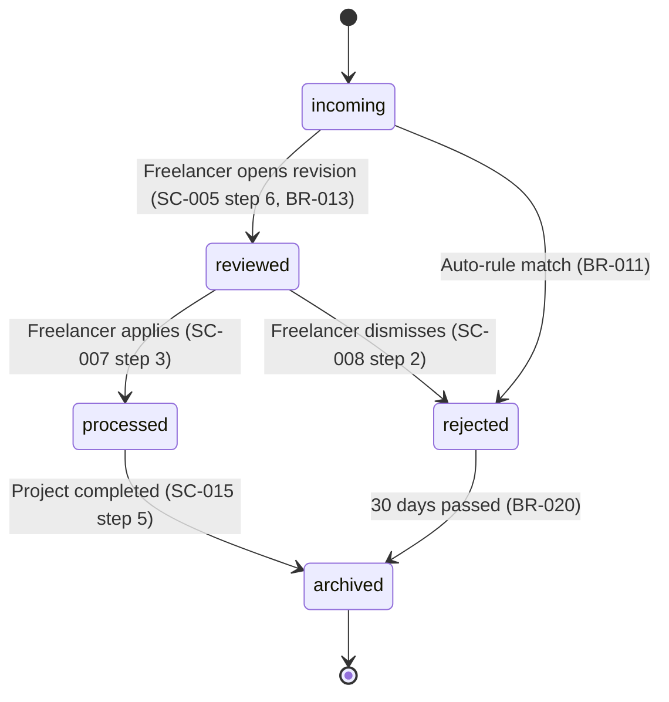
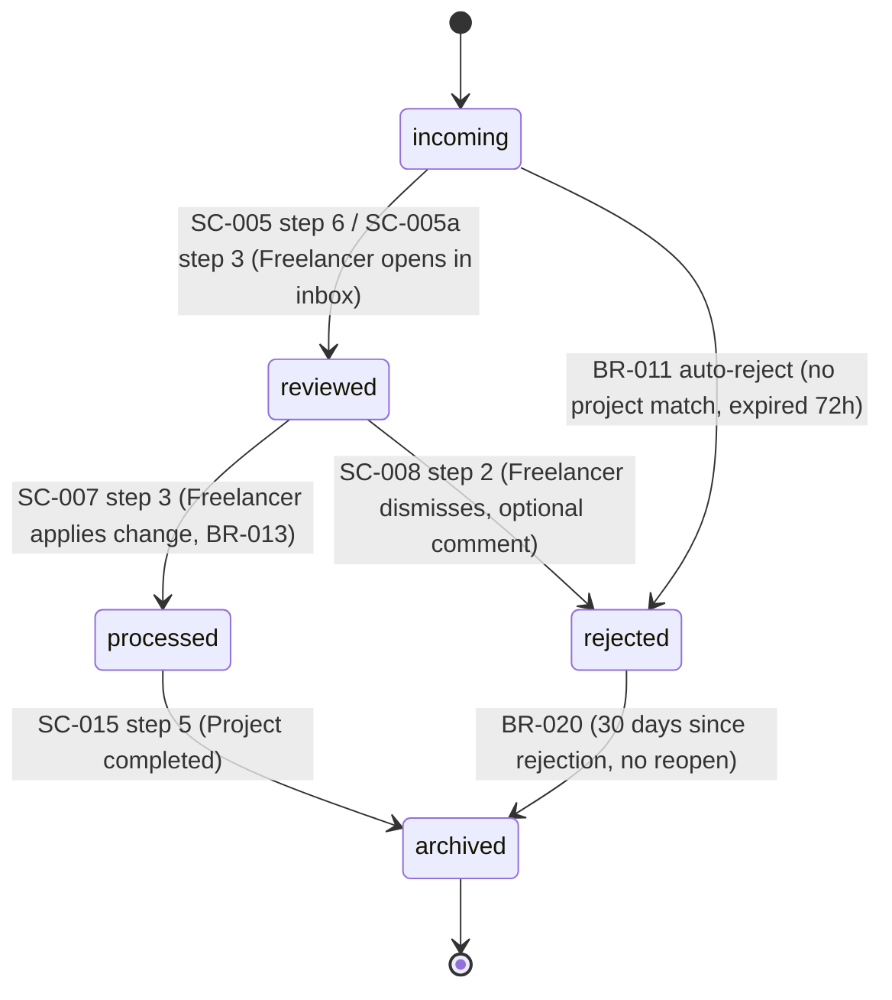

# LC-* — Entity Lifecycle Model

> **Тип:** lifecycle
> **Домен:** D2 — Behavioral
> **Review:** 🟢 Confirmation
> **Cardinality:** Per key entity (обычно 3–8 LC на продукт)
> **Владелец:** Product Module / процесс P2 (derived automatically, human confirms)

## Purpose

**Стейт-машина** ключевой бизнес-сущности: допустимые состояния, переходы между ними, триггеры и guard-условия. На 100% выводится из набора SC и BR — ассистент генерирует, человек подтверждает.

## Frontmatter Schema

```yaml
---
id: LC-<NNN>
type: lifecycle
entity: "EntityName"                   # имя сущности из BG
title: "Lifecycle: <entity>"
status: draft | active | deprecated
states: [state-1, state-2, ...]        # список всех состояний
initial_state: state-1
final_states: [state-final-1, ...]     # может быть несколько (completed, cancelled)
scenarios: [SC-<NNN>, ...]              # сценарии, порождающие переходы
rules: [BR-<NNN>, ...]                  # BR в guard-условиях
derived_from: [SC-<NNN>, BR-<NNN>]       # список источников
confidence: high | medium | low                  # C2 modification — обязательно
confidence_notes: "string"                       # required если confidence != high
created: YYYY-MM-DD
updated: YYYY-MM-DD
version: 1
---
```

## Body Structure

Обязательные секции:

1. **Entity definition.** Что за сущность (ссылка на термин в BG).
2. **States.** Список состояний с описанием каждого (что значит «это состояние» с точки зрения бизнеса).
3. **State diagram.** Mermaid-диаграмма переходов.
4. **Transitions.** Таблица: from-state × to-state × trigger × guard-условие (BR) × actor.
5. **Guards.** Описание guard-условий — ссылки на BR.
6. **Initial & final states.** Явно указанные стартовые и конечные состояния.
7. **Derivation trace.** Показывает, из каких SC/BR выведены конкретные states и transitions.

Опциональные:

- **Invariants** (ссылки на IC, применимые к этому LC)
- **Example trace** (конкретный путь одного экземпляра через states)

## Content Rules

- **Каждое state описано в бизнес-терминах.** `pending`, `in-progress`, `completed` — с объяснением, что значит для бизнеса.
- **Нет orphan states.** Все states должны быть достижимы из initial и иметь путь к final (кроме промежуточных, но и те связаны).
- **Transitions не дублируются.** Один (from, to, trigger) = один transition. Если два разных guard могут дать одинаковый transition — разделить.
- **Каждый guard = BR.** Transition с условием «если бюджет > N» должен ссылаться на конкретный BR, не inline.
- **State-transition triggers из SC.** Триггеры — это шаги SC. Без SC ссылки transition подвешен в воздухе.

### Mermaid формат диаграммы



## Relationships

**Входящие (derived_from):**
- ← SC-* (порождают transitions)
- ← BR-* (guard-условия)
- ← BG (имя сущности)

**Исходящие:**
- → VC-* (VC проверяют корректность transitions)
- → IC-* (инварианты про эту сущность — states не могут прыгать как попало)
- → External implementation (через handoff — служит технической моделью для ORM / state machine кода)

**Cascade impact:**
- Изменение SC → проверка LC (новый transition? изменилось guard?)
- Изменение BR → если BR в guards — проверить, что LC всё ещё консистентна
- Добавление state → проверка VC и IC на покрытие нового state

## Review Level: 🟢 Confirmation

LC — производный артефакт. Ассистент генерирует из SC + BR. Человек подтверждает корректность деривации: все ли states присутствуют, все ли transitions покрыты, нет ли ненужных.

**Важно:** хотя сам LC — Confirmation, его **корректность критична**: ошибка в state machine — это runtime bug. Поэтому validation V-05 (достижимость states), V-06 (полнота triggers/guards) — strict.

## Lifecycle States (для артефакта LC)

```
draft ──(human confirms)──▶ active ──(SC/BR change)──▶ draft ──(reconfirm)──▶ active v2
                              │
                              └──(entity deprecated)──▶ deprecated
```

## Examples

**Good:**
```yaml
---
id: LC-002
type: lifecycle
entity: Revision
title: "Lifecycle: Revision"
status: active
states: [incoming, reviewed, processed, rejected, archived]
initial_state: incoming
final_states: [archived]
scenarios: [SC-005, SC-005a, SC-007, SC-008, SC-015]
rules: [BR-011, BR-013, BR-020]
derived_from: [SC-005, SC-007, SC-008, SC-015, BR-010, BR-011, BR-013, BR-020]
---

## Entity definition
**Revision** (термин из BG) — правка от клиента на переведённый документ.
Имеет sender, body, position (if specified), project link.

## States

- **incoming** — Revision только получен (через email/manual/widget), ещё не 
  посмотрен freelancer'ом.
- **reviewed** — Freelancer открыл revision, увидел содержание, ещё не применил.
- **processed** — Freelancer применил правку в переводе (либо отверг с комментарием).
- **rejected** — Freelancer отверг revision (не соответствует исходному, дубликат, 
  вне scope). Может быть переоткрыт клиентом, пока project активен.
- **archived** — финальное состояние; revision не меняется, доступен read-only.

## State diagram



## Transitions

| From       | To         | Trigger                          | Guard (BR)    | Actor       |
|------------|------------|----------------------------------|---------------|-------------|
| incoming   | reviewed   | Freelancer opens revision        | —             | Freelancer  |
| incoming   | rejected   | Auto-reject window expired       | BR-011        | System      |
| reviewed   | processed  | Freelancer applies change        | BR-013        | Freelancer  |
| reviewed   | rejected   | Freelancer dismisses             | —             | Freelancer  |
| processed  | archived   | Project completes                | —             | System      |
| rejected   | archived   | 30 days since rejection          | BR-020        | System      |

## Guards

- **BR-011:** Auto-reject incoming revisions where no project match and 72h passed
- **BR-013:** Allow apply only if revision position still valid (document not changed drastically)
- **BR-020:** Auto-archive rejected revisions after 30 days of no client reopen

## Initial & final states

- **Initial:** `incoming` (каждая Revision создаётся здесь)
- **Final:** `archived` (единственное финальное; `rejected` не финальное — 
  client может reopen пока project активен)

## Derivation trace

- States `incoming`, `reviewed`, `processed` → из SC-005, SC-007
- State `rejected` → из SC-008 и BR-011
- State `archived` → из SC-015 (project completion) и BR-020 (auto-archive)

## Example trace

Revision R1:
1. Client sends email → R1 в `incoming` (SC-005)
2. Freelancer видит в inbox, открывает → `reviewed` (SC-005 step 6)
3. Freelancer применяет правку → `processed` (SC-007 step 3)
4. Project завершён через 2 недели → `archived` (SC-015 step 5)

Revision R2 (rejection path):
1. Client sends email → `incoming` (SC-005)
2. Freelancer открывает → `reviewed`
3. Freelancer dismisses (некорректная) → `rejected` (SC-008 step 2)
4. 30 days без reopen → `archived` (BR-020)
```

**Anti-example:**
```
## States
- pending, active, done                           ❌ без бизнес-описания

## Transitions
- pending → active                                 ❌ без trigger и guard
```

## Common Mistakes

1. **LC = UI screens.** LC — про бизнес-состояния сущности, не про отображение.
2. **Orphan states.** State `on-hold`, в который никто не переходит — удалить или добавить transition.
3. **Inline guards.** Условие «если X > 5» в LC без ссылки на BR — правило невидимо и не переиспользуется.
4. **Множественные initial states.** LC должен иметь одно начальное состояние (если логически два — это два разных LC).
5. **LC без final state.** Вечные сущности — обычно багdesign. Даже `archived` — финал.

## Related Skills

- `lifecycle-derivation.md` (в разработке, core алгоритм)
- `lifecycle-validation.md` (в разработке, V-05/V-06)
