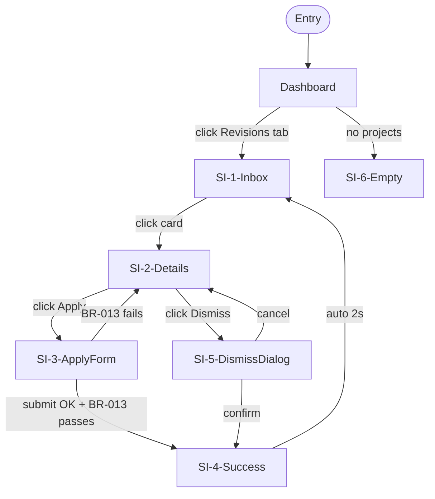
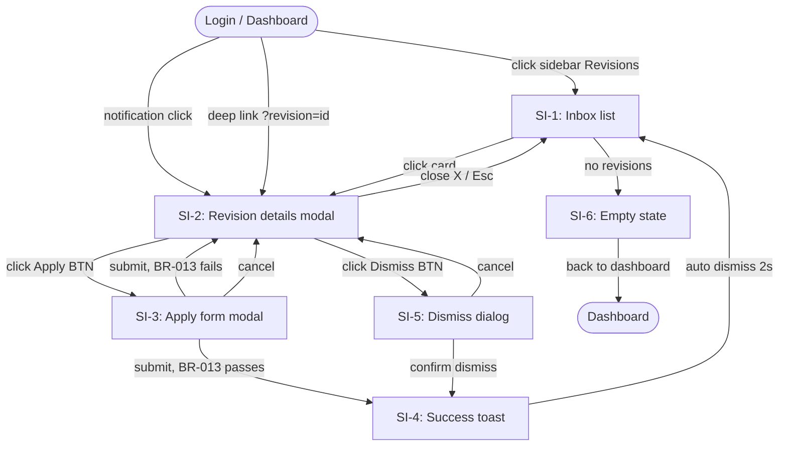

# NM-* — Navigation Map

> **Тип:** navigation-map
> **Домен:** D2-B04 — Design Module
> **Review:** 🟢 Confirmation
> **Cardinality:** Per flow (обычно 1 NM на feature с UI, может быть 2–3 для сложных)
> **Владелец:** Design Module — derived из MK-* + LC-*

## Purpose

**Карта переходов между экранами** одного flow. Описывает как пользователь перемещается между screens (из MK-*), какие триггеры, какие guard-условия (через LC), какие entry points (по ролям), где dead ends и error flows. Derived artifact — автогенерируется, человек подтверждает.

## Frontmatter Schema

```yaml
---
id: NM-<NNN>
type: navigation-map
title: "Navigation: <flow name>"
feature: FM-<NNN>
mockups: [MK-<NNN>, MK-<NNN>, ...]     # все MK задействованные в flow
roles: [R-<role>, ...]                  # роли, для которых flow
status: draft | active | deprecated
confidence: high | medium | low                  # C2 modification — обязательно
confidence_notes: "string"                       # required если confidence != high
created: YYYY-MM-DD
updated: YYYY-MM-DD
version: 1
---
```

## Body Structure

Обязательные секции (4):

1. **Flow Diagram.** Mermaid-граф переходов между экранами. Screens из Screen Inventory MK; edges с trigger + guard.
2. **Entry Points.** Как пользователь попадает в flow (по ролям): через sidebar nav, deep link, notification click, etc.
3. **Screen Transitions.** Таблица: from-screen → to-screen с trigger, guard (ссылки на BR/LC), animation.
4. **Dead Ends & Error Flows.** 404, unauthorized, session expired, max items reached — как обрабатываются.

## Content Rules

- **Все MK экраны присутствуют в диаграмме.** V-проверка: каждый Screen ID из Screen Inventory MK должен быть в NM Flow Diagram.
- **Каждый transition имеет trigger.** «Переход из A в B» без объяснения — нет.
- **Guard conditions через LC/BR.** Условные переходы должны ссылаться на LC transitions или BR rules, не inline.
- **Entry points явные.** Нельзя предполагать «пользователь как-то попадает сюда».
- **Error flows обязательны.** Хотя бы 404 + unauthorized.

### Mermaid format



## Relationships

**Входящие:**
- ← MK-* (screens, component states)
- ← LC-* (guards, transitions)
- ← BR-* (guard conditions)
- ← RPM (entry points per role)

**Исходящие:**
- → External implementation (через INT-15 handoff — routing configuration)
- → VC-* (navigation-specific критерии верификации)

**Cascade impact:**
- Новый экран в MK → проверить NM (добавлен ли в диаграмму?)
- Изменение transition в LC → проверить соответствующий guard в NM
- Добавление роли → проверить entry points

## Review Level: 🟢 Confirmation

Derived. Ассистент строит из MK + LC. Человек подтверждает полноту покрытия и логичность переходов.

## Lifecycle States

```
draft ──(confirm coverage)──▶ active ──(MK/LC change)──▶ draft ──▶ active v2
```

## Examples

**Good (фрагмент):**
```yaml
---
id: NM-003
type: navigation-map
title: "Navigation: Revisions workflow"
feature: FM-003
mockups: [MK-003]
roles: [R-freelancer]
status: active
---

## 1. Flow Diagram



## 2. Entry Points

| Role            | Entry                          | Conditions                              |
|-----------------|--------------------------------|------------------------------------------|
| R-freelancer    | Sidebar "Revisions" link       | Any time, shows badge if unread          |
| R-freelancer    | In-app notification click      | Notification received for new revision   |
| R-freelancer    | Email notification link        | Email: "You have new revision" → SI-2    |
| R-freelancer    | Deep link `?revision=<id>`     | Sharable URL                             |

## 3. Screen Transitions

| From    | To      | Trigger                          | Guard                    | Animation              |
|---------|---------|----------------------------------|--------------------------|------------------------|
| SI-1    | SI-2    | click on RevisionCard            | —                        | modal slide-up 200ms   |
| SI-1    | SI-6    | list empty (on load)             | revisions.length == 0    | —                      |
| SI-2    | SI-3    | click ApplyButton                | BR-013 eligibility       | modal transition       |
| SI-2    | SI-5    | click DismissButton              | —                        | modal transition       |
| SI-2    | SI-1    | close / Esc / click outside      | —                        | modal slide-down       |
| SI-3    | SI-4    | submit OK                        | BR-013 passes            | success animation      |
| SI-3    | SI-2    | submit fails                     | BR-013 fails             | shake + error inline   |
| SI-3    | SI-2    | cancel                           | —                        | modal close            |
| SI-5    | SI-4    | confirm                          | —                        | success animation      |
| SI-5    | SI-2    | cancel                           | —                        | modal close            |
| SI-4    | SI-1    | auto timeout 2s                  | —                        | toast fade-out         |

## 4. Dead Ends & Error Flows

### Session expired (any screen)
- Redirect to /login
- Preserve scroll position and modal state (reopen after login)

### Unauthorized (deep link to revision of other freelancer)
- Show "Revision not found or access denied" (privacy-safe message)
- Redirect to SI-1

### Revision deleted server-side (race condition)
- SI-2 shows "This revision is no longer available"
- Button "Back to inbox" → SI-1

### Network error on submit (SI-3)
- Keep modal open
- Toast "Connection error. Your data is preserved."
- Retry button

### Mobile: long revision body in SI-2 > screen
- Scrollable modal с sticky header (revision sender) + sticky footer (buttons)

### 404 (direct URL to non-existent revision)
- Standard 404 page → "Back to Revisions" link
```

**Anti-example:**
```mermaid
flowchart TD
    A --> B --> C                                  ❌ без triggers и guards
```

## Common Mistakes

1. **NM без triggers.** Диаграмма показывает связи, но не объясняет "почему переход".
2. **Missing error flows.** 404/unauthorized/session-expired часто забывают.
3. **Inline guards.** «Если все ok → next» без ссылки на BR.
4. **Dead ends не отмечены.** Пользователь застрял на экране без back link — UX-баг.
5. **Orphan screens.** MK screen, в который никто не переходит — либо забыли edge, либо лишний экран в MK.

## Related Skills

- `nm-derivation.md` (в разработке, автогенерация из MK + LC)
- `nm-coverage-check.md` (в разработке)
