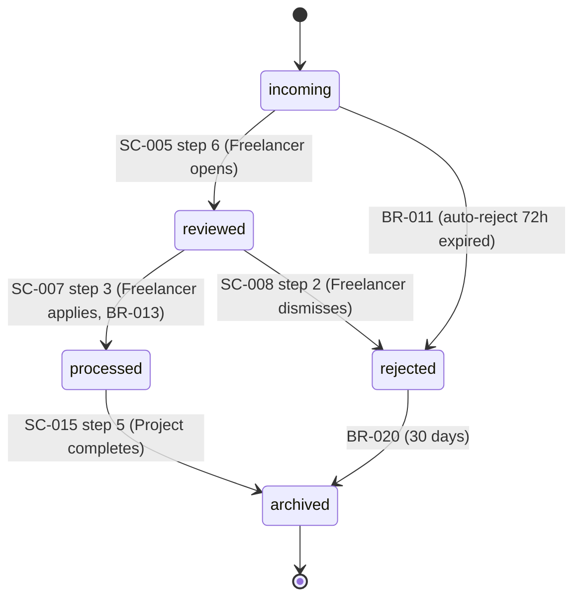

# Lifecycle Derivation — F.4 Skill

Derive lifecycle (state machine) for each key entity from SC transitions + BR guards. **🟢 Confirmation** level — purely derived; **A1 auto-approve eligible** per DEC-DEV-0013 #2 + #7 when conditions met.

## Input

- ≥1 SC в active (parent FM enrichment)
- ≥1 BR в active (для guard conditions)
- BG (entity name canonical)
- Existing LC в `.product/lifecycles/` (для cross-FM entities)

## Goal

Per key entity, produce `.product/lifecycles/LC-NNN-<slug>.md` artifact в active. **A1 auto-approve eligible** if confidence high + V-05 + V-06 passed (см. Step 8).

## Process

### Step 1: Identify entities needing LC

Scan active SC + BR для entities (BG terms representing core domain objects):
- **Has multiple states** mentioned (e.g., «incoming», «processed», «archived»)
- **Has transitions** in SC steps (entity X moves from state A to state B)
- **Has BR guards** affecting transitions

Skip:
- Entities mentioned but always в one state (no LC needed)
- Pure value objects (e.g., «email address», «phone number» — no state)

Typical: 1-3 LC per FM. If FM touches existing LC (e.g., shared «User» lifecycle from auth) — extend rather than duplicate.

### Step 2: Extract states for each entity

For entity X:
1. Read all SC steps mentioning X (or its synonyms per BG)
2. Identify state values: explicit «status: incoming» / implicit «X arrived» = state «incoming»
3. List all distinct states
4. Identify initial state (entity creation step in SC)
5. Identify final states (terminal: archived / completed / cancelled)

**Discipline:**
- Each state must be **business-meaningful** (не «state_42»)
- Each state needs **business description** в LC.body
- No orphan states (V-05 enforces — verified в Step 8)

### Step 3: Extract transitions

For each SC step that changes entity X state:
- From state → To state
- Trigger (SC step description, e.g., «Freelancer opens revision»)
- Guard (BR-NNN — applicable BR что должно pass; null if free transition)
- Actor (R-role from RPM — who triggers)

**Per transition table:**

| From | To | Trigger | Guard (BR) | Actor |
|------|-----|---------|------------|-------|
| <state-A> | <state-B> | <SC-NNN step N description> | BR-NNN or — | R-role |

### Step 4: Build state diagram

Generate Mermaid `stateDiagram-v2` from transitions table. Include:
- `[*] --> <initial>`
- All transitions с trigger labels
- All `<final> --> [*]` if applicable

Example:


### Step 5: Per-LC frontmatter

**Canonical fields per [LC.md artifact spec](../../docs/pmo/artifacts/LC.md):**

```yaml
---
id: LC-<NNN>                             # 3-digit padded; sequential
type: lifecycle
entity: "<EntityName>"                   # exact BG term (e.g., "Revision", "Project")
title: "Lifecycle: <entity>"
status: draft                            # → active after approve (A1 eligible)
states: [<state-1>, <state-2>, ...]      # all states
initial_state: <state-name>              # exactly one; required
final_states: [<state-1>, ...]           # ≥1; entities must reach final
scenarios: [SC-<NNN>, ...]               # SCs producing transitions; bi-dir с SC.lifecycle
rules: [BR-<NNN>, ...]                   # BRs in guards
derived_from: [SC-<NNN>, BR-<NNN>, ...]  # all sources scanned
confidence: high | medium | low
confidence_notes: |
  <what's solid: states extracted from SC explicit, transitions trigger'd by steps, guards reference BR>
  <what's assumed: some terminal transitions inferred from BR (e.g., auto-archive after 30 days)>
created: YYYY-MM-DD
updated: YYYY-MM-DD
version: 1
---
```

**Anti-pattern field names:**
- ❌ `confidence_rationale`, `rationale` → `confidence_notes`
- ❌ `entity_name`, `e` → `entity`
- ❌ `state_list`, `all_states` → `states`
- ❌ `initial`, `start_state`, `start` → `initial_state`
- ❌ `final`, `terminal_states`, `end_states` → `final_states`
- ❌ `transitions` (frontmatter) — нет такого поля; transitions живут в body
- ❌ `derived` → `derived_from`

### Step 6: Per-LC body structure

Per [LC.md spec §Body Structure](../../docs/pmo/artifacts/LC.md):

```markdown
# Lifecycle: <entity>

## Entity definition
**<Entity>** (BG term) — <one-paragraph: что за сущность, какие attributes, role в system>

## States
- **<state-1>** — <business meaning: what это значит для бизнеса; не «pending — waiting»; should explain «when entity is here, X is true / X happens»>
- **<state-2>** — ...
...

## State diagram
\`\`\`mermaid
stateDiagram-v2
    [*] --> <initial>
    <transitions>
    <final> --> [*]
\`\`\`

## Transitions

| From | To | Trigger | Guard (BR) | Actor |
|------|-----|---------|------------|-------|
| ... | ... | ... | ... | ... |

## Guards
- **BR-<NNN>:** <one-line rule purpose; что guards>
- ...

## Initial & final states
- **Initial:** `<state>` — <which event creates entity here>
- **Final:** `<state-1>`, `<state-2>` — <which conditions reach here>

## Derivation trace
- States `<X>`, `<Y>`, `<Z>` → from SC-<NNN>, SC-<MMM>
- State `<W>` → from BR-<NNN> (auto-transition condition)
- ...

## Example trace
<Concrete entity instance walking through states — helps reviewers visualize>
```

### Step 7: Filename

ASCII slug: `.product/lifecycles/LC-<NNN>-<slug>.md`. Slug = entity name lowercased.

Examples:
- entity: «Revision» → `LC-002-revision.md`
- entity: «Project» → `LC-001-project.md`

### Step 8: A1 auto-approve self-check (per DEC-DEV-0013 #2 + #7)

**Skill self-checks all conditions before deciding write path:**

**A1 conditions для LC:**
1. **`confidence: high`** — explicit, не «high-medium» или fuzzy
2. **`confidence_notes` non-empty** — must articulate rationale
3. **V-05 passed** — all states reachable from initial via parsed transitions:
   - BFS/DFS traversal от initial_state across transitions
   - Every state в states[] visited?
   - If orphan state found → V-05 fails
4. **V-06 passed** — every transition has trigger or guard:
   - Walk transitions table
   - For each: trigger (SC-NNN ref) OR guard (BR-NNN ref) present?
   - If transition без both → V-06 warning (downgrades confidence)

**Skill self-check pseudocode:**

```
fn a1_eligible(lc):
    if lc.confidence != "high": return false
    if not lc.confidence_notes: return false
    if not v05_passed(lc.states, lc.initial_state, lc.transitions): return false
    if not v06_passed(lc.transitions): return false
    return true
```

### Step 9a: A1 path (auto-approve)

If A1 eligible:

1. **Skill writes LC status=active, version: 1** directly (skip human approve gate)
2. **Create `.product/.decisions/journal.md`** if not exists; append entry per DEC-DEV-0013 #9 format:
   ```markdown
   ## DEC-AUTO-NNN — Auto-approve LC-<NNN>

   Date: <ISO timestamp>
   Triggered by: lifecycle-derivation.md A1 logic
   Confidence: high
   Conditions met:
     - V-05 passed (all <N> states reachable from <initial>)
     - V-06 passed (all <M> transitions have trigger or guard)
     - confidence_notes non-empty
   Rationale: <skill-provided one-paragraph — derivation reasoning + verification summary>
   Revert: type 'revert LC-<NNN>' в conversation
   ```
3. **Return «auto-approved» signal** to orchestrator (feature-session.md surfaces conversational notification к user — see [feature-session.md A1 flow](feature-session.md))

### Step 9b: Standard path (🟢 Confirmation gate)

If A1 conditions fail (any):

1. **Surface к user:**
   ```
   LC-<NNN> draft ready для approve.

   Confidence: <level>
   Rationale: <one-paragraph>

   A1 auto-approve NOT eligible because:
     - <reason: V-06 fails — transition X→Y has no trigger or guard>

   Manual confirmation needed (🟢 Confirmation gate — human verifies derivation correctness).

   Approve LC-<NNN>? [Y/N/edit]
   ```

2. **On user approve:** standard post-approve actions:
   - Status → active, version: 1
   - Bi-dir update FM.lifecycles[] += LC-NNN
   - Decision journal entry (non-AUTO):
     ```markdown
     ## DEC-PLAN-NNN — LC-<NNN> approved (manual)
     ...
     ```

### Step 10: Post-approve actions (both paths)

- **Update SC.lifecycle** for related SCs (V-11 bi-dir)
- **Update BR.lifecycles[]** for BRs в guards
- **Update FM.lifecycles[]** += LC-NNN
- **Cascade-check.js** auto-runs (downstream IC и VC checked)
- **BG extraction** queued

## Confidence calibration (C2)

| Уровень | Когда применять | A1 eligible? |
|---|---|---|
| **high** | All states business-meaningful; all transitions have trigger or guard from SC/BR; initial + final clear; no orphans; example trace coherent | Yes (если V-05/V-06 pass) |
| **medium** | Most states clear но 1-2 transitions inferred (auto-archive timing guessed); guards generic | No — manual gate |
| **low** | Speculative LC (entity not really lifecycle'd, just attribute); should reconsider | No |

## Anti-patterns

1. **LC = UI screens.** LC — business states, не UI views. «Revision in inbox» — это не state; «incoming» — state.
2. **Orphan states.** State без incoming transition → V-05 fails. Either remove или add transition.
3. **Inline guards без BR ref.** «If X > 5» в transitions table without BR-NNN — rule invisible, не reusable. Always reference BR.
4. **Multiple initial states.** LC must have one initial. Если две сущности с different initials — это два LC.
5. **No final states.** Entities обычно reach terminal state. «archived», «completed», «deleted» — final. Без final state → entity «вечная», обычно bug.
6. **A1 false positive.** If skill self-checks pass но logic actually flawed — это skill bug (systemic). Surface via /ecosystem:meta-feedback. **Never bypass A1 conditions to ускорить flow.**
7. **Skip Mermaid diagram.** Diagram — visual reviewer aid; required per LC.md body structure.
8. **Variant field names** — use canonical exactly.

## Examples

**Good LC fragment с A1 eligible:** см. [LC.md §Examples](../../docs/pmo/artifacts/LC.md) — full LC-002 Revision lifecycle.

**Anti-example:**
```yaml
---
id: LC-002
entity: revisions                         # ❌ lowercase, plural — should be canonical "Revision"
states: [pending, active, done]           # ❌ generic, no business meaning
initial: pending                          # ❌ wrong field name (initial_state)
confidence: high                          # ❌ marked high but no V-05/V-06 check
---

## Transitions
| From | To | Trigger |                    # ❌ no Guard column; some transitions без BR
| pending | active | "стартует" |          # ❌ vague trigger, no SC ref
```

## Related

- [`feature-session.md`](feature-session.md) — orchestrator (delegates F.4; surfaces A1 notification)
- [`scenario-authoring.md`](scenario-authoring.md) — F.2 (LC.scenarios source)
- [`business-rule-extraction.md`](business-rule-extraction.md) — F.3 (LC.rules source for guards)
- [`vc-derivation.md`](vc-derivation.md) — F.6 (VC verifies LC transitions)
- Artifact spec: [docs/pmo/artifacts/LC.md](../../docs/pmo/artifacts/LC.md)
- Validation: V-05, V-06 в [docs/pmo/validation.md](../../docs/pmo/validation.md)
- Process: [docs/pmo/processes.md §3.2 P2.A F.4](../../docs/pmo/processes.md), §2.5.2 (auto-approve A1)
