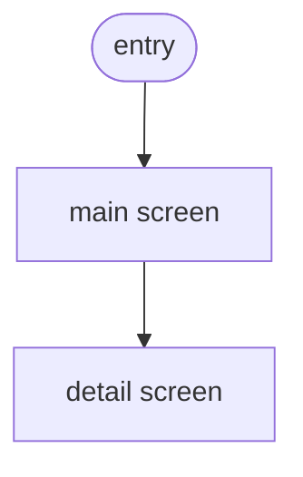

<!--
  REGRESSION FIXTURE (DEC-DEV-0068 / Orchestrator dogfood RUN 01).
  This handoff embeds MK/NM UI sub-documents under §10 whose own `## 1.`–`## 7.`
  headers RESTART numbering. A naive flat section parser (last-write-wins) would
  clobber the real §1/§5/§6 with UI content — cc-sdd then receives WCAG notes as
  `scenarios` and UI edge-states as `business_rules` (silent fidelity loss).
  The extractSections monotonic guard + the blocking C-07 content-fidelity check
  must keep §1/§5/§6/§9 intact. Exercised by
  tests/adapters/handoff-ccsdd.contract.test.cjs.
  generator product-module-v1.4.0 also exercises the C-03 supported-range bump.
-->

## 1. Executive Summary

REAL-EXEC-SUMMARY-SENTINEL. This prose is the genuine Executive Summary and must
survive into `description` — it must NOT be overwritten by the restarted §10
sub-document headers below.

## 2. Business Context

Synthetic but genuine §2 body. Must survive into `business_context`.

## 3. Terminology

- **Widget** — a synthetic domain term.

## 4. Role & Permission Model

- **R-user** — the only actor.

## 5. Scenarios

### SC-001 — Real scenario that must land in `scenarios`

**Actors:** R-user
**Trigger:** user acts
**Steps:**
1. user does the thing
**Postconditions:** thing done

## 6. Business Rules

### BR-001 — Real business rule that must land in `business_rules`

**Statement:** the rule holds for all inputs.

## 7. Entity Lifecycles

Synthetic lifecycle: captured → active → archived.

## 8. Verification Criteria

Synthetic VC: covered by SC-001.

## 9. Invariants

### IC-001 — Real invariant that must land in `invariants`

**Statement:** the invariant is always upheld.

## 10. UI Specification

> Embedded mockup (MK) + navigation-map (NM) sub-documents. Their own `## N.`
> headers RESTART at 1 — the parser must treat them as §10 body content, NOT as
> top-level handoff sections.

## 1. Screen Inventory

- SI-1 main screen
- SI-2 detail screen

## 2. Component State Matrix

| component | state |
|---|---|
| button | idle/loading |

## 5. Accessibility Notes

WCAG 2.1 AA. Focus order, contrast ratio ≥ 4.5:1, visible focus ring.
(Note: this body carries NO SC- identifier — if it clobbered the real §5,
the blocking C-07 check would fail.)

## 6. Edge Cases

Offline mode, slow network, empty state.
(Note: this body carries NO BR- identifier — if it clobbered the real §6,
the blocking C-07 check would fail.)

## 7. Design Decisions Log

- DDL-1: chose tabs over accordion.

## 1. Flow Diagram

## 2. Entry Points

- deep link `/widget/:id`

## 11. Non-Functional Requirements

Synthetic NFR: p95 < 200ms.

## 13. Out of Scope

- Explicitly out: bulk import, export.
